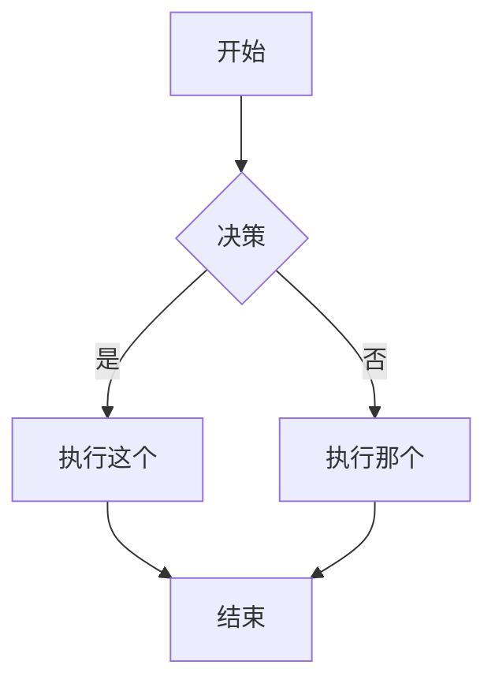
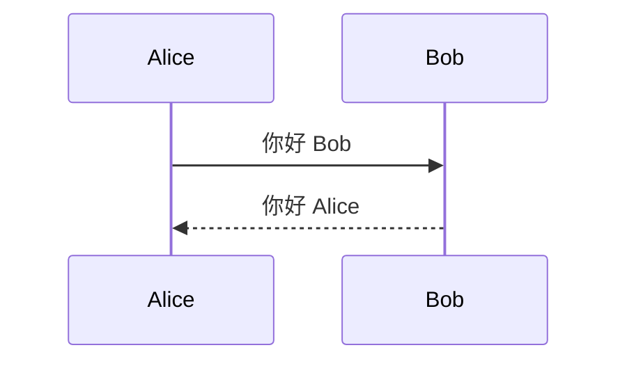
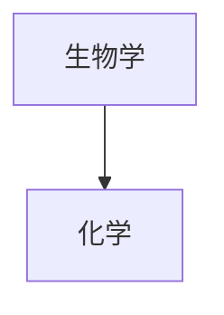
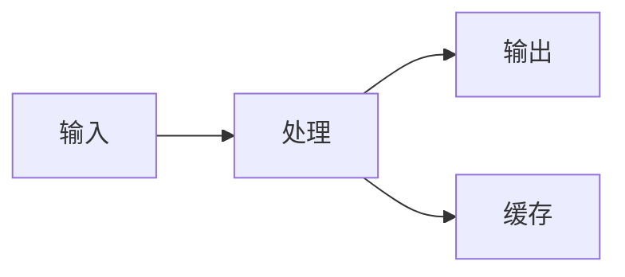

# Obsidian 风格 Markdown 技能

本技能使 AI 智能体能够创建和编辑有效的 Obsidian 风格 Markdown，包括所有 Obsidian 特有的语法扩展。

## 概述

Obsidian 使用多种 Markdown 风格的组合：
- [CommonMark](https://commonmark.org/)
- [GitHub Flavored Markdown](https://github.github.com/gfm/)
- [LaTeX](https://www.latex-project.org/) 用于数学公式
- Obsidian 特有扩展（双链、Callout、嵌入等）

## 基础格式

### 段落和换行

```markdown
这是一个段落。

这是另一个段落（段落之间用空行分隔）。

在段落内换行，在行尾添加两个空格
或使用 Shift+Enter。
```

### 标题

```markdown
# 一级标题
## 二级标题
### 三级标题
#### 四级标题
##### 五级标题
###### 六级标题
```

### 文本格式

| 样式 | 语法 | 示例 | 效果 |
|------|------|------|------|
| 粗体 | `**文本**` 或 `__文本__` | `**粗体**` | **粗体** |
| 斜体 | `*文本*` 或 `_文本_` | `*斜体*` | *斜体* |
| 粗体+斜体 | `***文本***` | `***两者***` | ***两者*** |
| 删除线 | `~~文本~~` | `~~删除~~` | ~~删除~~ |
| 高亮 | `==文本==` | `==高亮==` | ==高亮== |
| 行内代码 | `` `代码` `` | `` `代码` `` | `代码` |

### 转义格式

使用反斜杠转义特殊字符：
```markdown
\*这不会是斜体\*
\#这不会是标题
1\. 这不会是列表项
```

常见需要转义的字符：`\*`、`\_`、`\#`、`` \` ``、`\|`、`\~`

## 内部链接（双链）

### 基本链接

```markdown
[[笔记名称]]
[[笔记名称.md]]
[[笔记名称|显示文本]]
```

### 链接到标题

```markdown
[[笔记名称#标题]]
[[笔记名称#标题|自定义文本]]
[[#同一笔记中的标题]]
[[##搜索库中所有标题]]
```

### 链接到块

```markdown
[[笔记名称#^块ID]]
[[笔记名称#^块ID|自定义文本]]
```

在段落末尾添加 `^块ID` 来定义块 ID：
```markdown
这是一个可以被链接到的段落。 ^我的块ID
```

对于列表和引用，在单独一行添加块 ID：
```markdown
> 这是一段引用
> 有多行内容

^引用ID
```

### 搜索链接

```markdown
[[##标题]]     搜索包含「标题」的标题
[[^^块]]       搜索包含「块」的块
```

## Markdown 风格链接

```markdown
[显示文本](笔记%20名称.md)
[显示文本](笔记%20名称.md#标题)
[显示文本](https://example.com)
[笔记](obsidian://open?vault=库名称&file=笔记.md)
```

注意：Markdown 链接中的空格必须 URL 编码为 `%20`。

## 嵌入

### 嵌入笔记

```markdown
![[笔记名称]]
![[笔记名称#标题]]
![[笔记名称#^块ID]]
```

### 嵌入图片

```markdown
![[图片.png]]
![[图片.png|640x480]]    宽度 x 高度
![[图片.png|300]]        仅宽度（保持宽高比）
```

### 外部图片

```markdown


```

### 嵌入音频

```markdown
![[音频.mp3]]
![[音频.ogg]]
```

### 嵌入 PDF

```markdown
![[文档.pdf]]
![[文档.pdf#page=3]]
![[文档.pdf#height=400]]
```

### 嵌入列表

```markdown
![[笔记#^列表ID]]
```

其中列表已定义了块 ID：
```markdown
- 项目 1
- 项目 2
- 项目 3

^列表ID
```

### 嵌入搜索结果

````markdown
```query
tag:#项目 status:done
```
````

## Callout（提示框）

### 基本 Callout

```markdown
> [!note]
> 这是一个笔记 Callout。

> [!info] 自定义标题
> 这个 Callout 有自定义标题。

> [!tip] 仅标题
```

### 可折叠 Callout

```markdown
> [!faq]- 默认折叠
> 此内容在展开前是隐藏的。

> [!faq]+ 默认展开
> 此内容可见但可折叠。
```

### 嵌套 Callout

```markdown
> [!question] 外层 Callout
> > [!note] 内层 Callout
> > 嵌套内容
```

### 支持的 Callout 类型

| 类型 | 别名 | 描述 |
|------|------|------|
| `note` | - | 蓝色，铅笔图标 |
| `abstract` | `summary`、`tldr` | 青色，剪贴板图标 |
| `info` | - | 蓝色，信息图标 |
| `todo` | - | 蓝色，复选框图标 |
| `tip` | `hint`、`important` | 青色，火焰图标 |
| `success` | `check`、`done` | 绿色，勾选图标 |
| `question` | `help`、`faq` | 黄色，问号图标 |
| `warning` | `caution`、`attention` | 橙色，警告图标 |
| `failure` | `fail`、`missing` | 红色，X 图标 |
| `danger` | `error` | 红色，闪电图标 |
| `bug` | - | 红色，虫子图标 |
| `example` | - | 紫色，列表图标 |
| `quote` | `cite` | 灰色，引用图标 |

### 自定义 Callout（CSS）

```css
.callout[data-callout="custom-type"] {
  --callout-color: 255, 0, 0;
  --callout-icon: lucide-alert-circle;
}
```

## 列表

### 无序列表

```markdown
- 项目 1
- 项目 2
  - 嵌套项目
  - 另一个嵌套
- 项目 3

* 星号也可以
+ 加号也可以
```

### 有序列表

```markdown
1. 第一项
2. 第二项
   1. 嵌套编号
   2. 另一个嵌套
3. 第三项

1) 替代语法
2) 用括号
```

### 任务列表

```markdown
- [ ] 未完成任务
- [x] 已完成任务
- [ ] 带子任务的任务
  - [ ] 子任务 1
  - [x] 子任务 2
```

## 引用

```markdown
> 这是一个引用块。
> 可以跨多行。
>
> 包含多个段落。
>
> > 嵌套引用也可以。
```

## 代码

### 行内代码

```markdown
使用 `反引号` 表示行内代码。
使用双反引号表示 ``包含 ` 反引号的代码``。
```

### 代码块

````markdown
```
纯代码块
```

```javascript
// 语法高亮代码块
function hello() {
  console.log("Hello, world!");
}
```

```python
# Python 示例
def greet(name):
    print(f"Hello, {name}!")
```
````

### 嵌套代码块

外层使用更多反引号或波浪号：

`````markdown
````markdown
这是如何创建代码块：
```js
console.log("Hello")
```
````
`````

## 表格

```markdown
| 标题 1 | 标题 2 | 标题 3 |
|--------|--------|--------|
| 单元格 1 | 单元格 2 | 单元格 3 |
| 单元格 4 | 单元格 5 | 单元格 6 |
```

### 对齐

```markdown
| 左对齐 | 居中 | 右对齐 |
|:-------|:----:|-------:|
| 左 | 中 | 右 |
```

### 表格中使用管道符

用反斜杠转义管道符：
```markdown
| 列 1 | 列 2 |
|------|------|
| [[链接\|显示]] | ![[图片\|100]] |
```

## 数学公式（LaTeX）

### 行内公式

```markdown
这是行内公式：$e^{i\pi} + 1 = 0$
```

### 块级公式

```markdown
$$
\begin{vmatrix}
a & b \\
c & d
\end{vmatrix} = ad - bc
$$
```

### 常用数学语法

```markdown
$x^2$              上标
$x_i$              下标
$\frac{a}{b}$      分数
$\sqrt{x}$         平方根
$\sum_{i=1}^{n}$   求和
$\int_a^b$         积分
$\alpha, \beta$    希腊字母
```

## 图表（Mermaid）

````markdown

````

### 时序图

````markdown

````

### 图表中的链接

````markdown

````

## 脚注

```markdown
这句话有脚注[^1]。

[^1]: 这是脚注内容。

你也可以使用命名脚注[^note]。

[^note]: 命名脚注仍显示为数字。

行内脚注也支持。^[这是行内脚注。]
```

## 注释

```markdown
这是可见的 %%但这是隐藏的%% 文本。

%%
整个块都是隐藏的。
不会出现在阅读视图中。
%%
```

## 分隔线

```markdown
---
***
___
- - -
* * *
```

## 属性（Frontmatter）

属性使用 YAML frontmatter 在笔记开头：

```yaml
---
title: 我的笔记标题
date: 2024-01-15
tags:
  - 项目
  - 重要
aliases:
  - 我的笔记
  - 替代名称
cssclasses:
  - 自定义样式
status: 进行中
rating: 4.5
completed: false
due: 2024-02-01T14:30:00
---
```

### 属性类型

| 类型 | 示例 |
|------|------|
| 文本 | `title: 我的标题` |
| 数字 | `rating: 4.5` |
| 复选框 | `completed: true` |
| 日期 | `date: 2024-01-15` |
| 日期时间 | `due: 2024-01-15T14:30:00` |
| 列表 | `tags: [一, 二]` 或 YAML 列表 |
| 链接 | `related: "[[其他笔记]]"` |

### 默认属性

- `tags` - 笔记标签
- `aliases` - 笔记的替代名称
- `cssclasses` - 应用到笔记的 CSS 类

## 标签

```markdown
#标签
#嵌套/标签
#带-连字符-的标签
#带_下划线_的标签

在 frontmatter 中：
---
tags:
  - 标签1
  - 嵌套/标签2
---
```

标签可以包含：
- 字母（任何语言）
- 数字（不能作为首字符）
- 下划线 `_`
- 连字符 `-`
- 正斜杠 `/`（用于嵌套）

## HTML 内容

Obsidian 支持 Markdown 中的 HTML：

```markdown
<div class="custom-container">
  <span style="color: red;">彩色文本</span>
</div>

<details>
  <summary>点击展开</summary>
  隐藏内容在这里。
</details>

<kbd>Ctrl</kbd> + <kbd>C</kbd>
```

## 完整示例

````markdown
---
title: 项目 Alpha
date: 2024-01-15
tags:
  - 项目
  - 进行中
status: 进行中
priority: 高
---

# 项目 Alpha

## 概述

本项目旨在使用现代技术[[改进工作流]]。

> [!important] 关键截止日期
> 第一个里程碑截止日期是 ==1月30日==。

## 任务

- [x] 初步规划
- [x] 资源分配
- [ ] 开发阶段
  - [ ] 后端实现
  - [ ] 前端设计
- [ ] 测试
- [ ] 部署

## 技术笔记

主算法使用 $O(n \log n)$ 排序公式。

```python
def process_data(items):
    return sorted(items, key=lambda x: x.priority)
```

## 架构



## 相关文档

- ![[会议记录 2024-01-10#决策]]
- [[预算分配|预算]]
- [[团队成员]]

## 参考资料

更多详情请参阅官方文档[^1]。

[^1]: https://example.com/docs

%%
内部笔记：
- 周五与团队审查
- 考虑替代方案
%%
````

## 参考资料

- [基础格式语法](https://help.obsidian.md/syntax)
- [高级格式语法](https://help.obsidian.md/advanced-syntax)
- [Obsidian 风格 Markdown](https://help.obsidian.md/obsidian-flavored-markdown)
- [内部链接](https://help.obsidian.md/links)
- [嵌入文件](https://help.obsidian.md/embeds)
- [Callout](https://help.obsidian.md/callouts)
- [属性](https://help.obsidian.md/properties)
